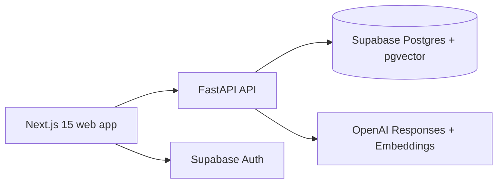

# VibeUI

AI-powered mobile app design generation with a FastAPI backend, Next.js dashboard, Supabase Auth/Postgres/pgvector, and OpenAI Responses API.

## Architecture



## Features

- Public live demo that streams generated screens over SSE.
- Authenticated dashboard for playground, projects, API keys, history, agents, and settings.
- Static sandboxed iframe previews with no script execution.
- RAG design-pattern search over `design_patterns` using pgvector.
- Agent workflows for design critique, competitor analysis, and accessibility audits.
- API key authentication for programmatic access.
- GitHub Actions CI for backend tests and frontend lint/build.

## Local Development

```powershell
cd "G:\Resume Projects\vibeui\api"
Copy-Item .env.example .env
uv sync
uv run python run.py
```

```powershell
cd "G:\Resume Projects\vibeui\web"
Copy-Item .env.local.example .env.local
npm install
npm run dev
```

Apply `supabase/migrations/001_initial_schema.sql` in the Supabase SQL editor, then seed patterns:

```powershell
cd "G:\Resume Projects\vibeui\api"
uv run python -m app.seed.seed_patterns
uv run python -m app.seed.seed_patterns --patterns-file .\app\seed\design_patterns.json
```

## API

```bash
curl http://localhost:8000/health
curl -N -X POST http://localhost:8000/v1/generate \
  -H "Content-Type: application/json" \
  -d '{"prompt":"fitness coach app","num_screens":3,"style":"modern","platform":"ios"}'
```

Authenticated calls accept either a Supabase user JWT or a Vibe API key:

```bash
Authorization: Bearer vui_live_...
```

## Security Notes

Generated HTML is sanitized server-side and rendered in an iframe with `sandbox=""`, `referrerPolicy="no-referrer"`, and a strict `srcDoc` CSP:

```text
default-src 'none'; script-src 'none'; style-src 'unsafe-inline'; img-src data: blob:;
connect-src 'none'; font-src 'none'; frame-src 'none'; form-action 'none'; base-uri 'none'; object-src 'none'
```

The backend uses one `asyncpg` pool initialized in FastAPI lifespan and closed on shutdown. Public demo rate limiting uses in-memory `slowapi`, which is suitable for a single Railway instance. Use Redis-backed rate limits before scaling to multiple API instances.

## Deployment

Deploy `api/` to Railway with the Dockerfile and set `DATABASE_URL`, `SUPABASE_URL`, `OPENAI_API_KEY`, and `CORS_ORIGINS`.

Deploy `web/` to Vercel and set `NEXT_PUBLIC_API_URL`, `NEXT_PUBLIC_SUPABASE_URL`, and `NEXT_PUBLIC_SUPABASE_PUBLISHABLE_KEY`.

After deployment, update API `CORS_ORIGINS` with the Vercel URL and add Supabase Auth redirect URLs for local and production callback routes.
